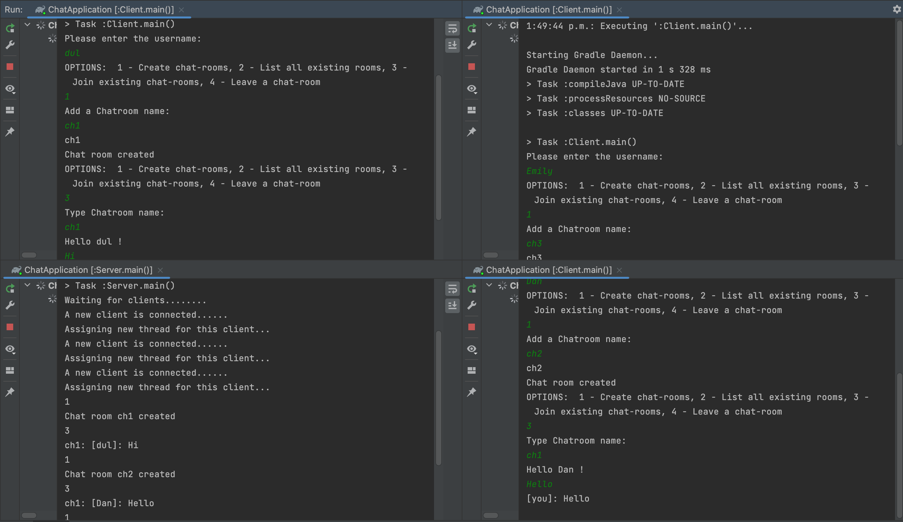

### Chat app in java

I utilized Java threads and locks to develop an innovative application that enables clients to create, browse available chat rooms, and join one. The platform allows all members of a chatroom to view and send messages to other members through Java sockets.

To run the Java application, you need to follow two simple steps. 
1. First, start the server class by using the "javac Server.java" command. 
2. Then, create multiple instances of the client class to communicate with the server class using the "javac Client.java" command. 

To request any option in the chat application, the client can simply select the **corresponding option number.** This allows for easy navigation and selection of desired functions within the application.

